# Palestra — Do upstream ao deploy

> **Evento:** [Agile Brazil 2026](https://www.agilebrazil.com/2026/) · Foz do Iguaçu · 12–13 nov 2026  
> **Título:** Do upstream ao deploy: como automatizar o downstream sem remover os gates humanos  
> **Caso:** Cripto Farol (fluxo atual) — relato de experiência, não pitch comercial  
> **Card:** [#582](https://github.com/oalansilva/crypto/issues/582)  
> **Uso:** copiar cada bloco `## SLIDE` para um slide no Google Slides / Keynote  
> **Bloco skills (11–14 min):** não duplicar aqui — usar [`docs/palestra-upstream-deploy-slide-skills.md`](palestra-upstream-deploy-slide-skills.md)  
> **Fonte canônica de processo:** `AGENTS.md`, `.cursor/skills/` (GitHub), `.agents/skills/`

---

## SLIDE 1 — Título

**Do upstream ao deploy**

Como automatizar o downstream **sem remover os gates humanos**

Agile Brazil 2026 · Foz do Iguaçu · 12–13 nov  
Caso real: Cripto Farol · Cursor Agent

---

## SLIDE 2 — O que esta palestra **não** é

Não é demo de produto.  
Não é “IA escreve o código e pronto”.

É um **relato de experiência**: como um time pequeno transformou demanda → produção numa máquina de estados **auditável**, com agentes — e **human-in-the-loop** onde a decisão importa.

---

## SLIDE 3 — Mensagem central

**Automatize o verificável.  
Reserve o humano para o irreversível.**

Skills, CI e Playwright **não** substituem o humano.  
Elas *codificam* o que o agente pode fazer **entre** os gates.

O chat (`implemente`) **não** é aprovação.

---

## SLIDE 4 — Enquete (0–3 min)

**Onde o fluxo trava hoje na sua operação?**

1. Triagem / refinamento  
2. Design  
3. Dev  
4. Code review  
5. QA  
6. Homologação **ou** produção  

**Contagem ao vivo:** mão no ar (sala) ou número no chat (remoto). Alan anota no quadro. Sem app.

---

## SLIDE 5 — Problema (3–7 min)

Gerar código **não** é o gargalo.

O custo está depois: refinar, especificar, desenhar, revisar o diff, QA, homologar, publicar — **sem lembrete, sem pular etapa, sem perder o controle**.

Downstream sem contrato = agente rápido e **irresponsável**.

---

## SLIDE 6 — Modelo replicável (7 pontos)

1. **Fonte única de estado** — campo `Status` do board (não o chat)  
2. **Contrato entre etapas** — OpenSpec + checklist por coluna  
3. **Skills como runbooks** — instrução versionada, não prompt ad hoc  
4. **Transições verificáveis** — gate bloqueia sem evidência  
5. **Limites de autonomia** — WIP, locks, quem move o quê  
6. **Human-in-the-loop** — quatro gates que o agente **nunca** cruza  
7. **Papéis nomeados** — 6 papéis no mesmo Cursor Agent (`inherit`) + humano

---

## SLIDE 7 — HITL: por que existe

**Human-in-the-loop** não é burocracia.

Automação de agentes **sem** gates humanos = autonomia **sem** accountability.

| Máquina | Humano |
| --- | --- |
| Transição verificável (teste, artefato, SHA) | Decisão de julgamento |
| Evidência que bloqueia avanço | Aposta irreversível (prioridade, produto, produção) |

---

## SLIDE 8 — Quatro gates (o *porquê*)

| # | Gate | Humano decide | Por que o agente não cruza |
| --- | --- | --- | --- |
| **0** | Em Refinamento → Todo | O que entra no backlog | Senão o agente trabalha **tudo** |
| **1** | Aprovação de Design → Pronto para Dev | Se é a coisa certa | O agente otimiza o **prompt**, não o usuário |
| **2** | Done → Homologado | Se funciona para quem pediu | Teste verde ≠ julgamento de produto |
| **3** | Homologado → Pronto | Se pode ir a produção | Merge em `main` ≠ operação |

---

## SLIDE 9 — Papéis (não são 6 modelos)

**Cursor Agent** = um modelo (o do chat). Subagents usam `inherit`.

| Papel | Faz |
| --- | --- |
| **main** | Orquestra, fala com o humano, aciona o próximo |
| **PO** | OpenSpec (`proposal`, specs, tasks) |
| **DESIGN** | `design.md`, crítica isolada |
| **DEV** | Código + review do **diff exato** antes do commit |
| **QA** | qa-gate, Playwright visual |
| **Kaizen** | Audita processo (read-only); propõe, não implementa |
| **Humano** | Os 4 gates — o agente nunca cruza |

Skill = *como*. Agente = *quem*. Board = *se* avançou.

---

## SLIDE 10 — Board real (12 colunas)

Mapa do campo `Status` do [Project 1](https://github.com/users/oalansilva/projects/1) — **não** é screenshot fotográfico (captura autenticada do GitHub indisponível neste apply).

**Entrada obrigatória de todo card:** **Em Refinamento** (Alan prioriza, escolhe ou cancela).

```text
Em Refinamento
  → Todo → Design → Aprovação de Design
  → Pronto para Dev → Em desenvolvimento → Code Review → QA
  → Done → Homologado → Pronto
Cancelado  (terminal, inclusive a partir de Em Refinamento)
```

Não usamos o vocabulário genérico *In Progress* como contrato atual.

---

## SLIDE 11 — Três status que a plateia confunde

| Status | Significa | Quem |
| --- | --- | --- |
| **Done** | Done **técnico** (QA verde, em `develop`, URL DEV ok) | Agente + CI |
| **Homologado** | Humano testou em `develop` | Gate HITL 2 |
| **Pronto** | Produção **com** deploy validado + `release-guard post` PASS | Gate HITL 3 |

Merge em `main` **sozinho** não autoriza Pronto.

---

## SLIDE 12 — Skills (11–14 min)

**Trocar para o bloco projetor:** [`palestra-upstream-deploy-slide-skills.md`](palestra-upstream-deploy-slide-skills.md) (13 slides).

Lembrete de uma linha:

- Canônico: **`.cursor/skills/`** no GitHub (`alan-workflow`, ambientes, board)  
- OpenSpec: `/opsx:new` → `/opsx:ff` → publicar Gist → `/opsx:apply` **só após** Pronto para Dev  
- Design: `design-critic` · UI: `impeccable` · browser: `playwright-cli`  
- Release: `alan-workflow-ambientes` · `/kaizen` · `release-guard`

**Skill ≠ gate humano.**

---

## SLIDE 13 — Caso: três trilhas (14–20 min)

**OpenSpec**  
`/opsx:new` → `/opsx:ff` → Gist no card → `design-critic` → **HITL 1** → `/opsx:apply` → `/opsx:verify` → archive no release

**Técnica (card)**  
branch `card-<id>-…` a partir de `develop` → Em desenvolvimento → Code Review (diff) → QA → PR → `develop` → `./restart` → **Done técnico** → **HITL 2** Homologado

**Release**  
pacote Homologado → `release-guard pre` → PR `develop→main` → merge → **deploy PROD** → `/kaizen release` → `release-guard post` → **HITL 3** Pronto

---

## SLIDE 14 — Diagrama (slide-chave)

```mermaid
flowchart LR
  subgraph intake [Entrada]
    R[Em Refinamento]
  end
  subgraph human0 [HITL 0]
    R -->|humano: prioriza ou cancela| T[Todo]
  end
  subgraph upstream [Upstream]
    T -->|opsx:new/ff| OS[OpenSpec]
    OS --> D[Design]
    D -->|design-critic| AD[Aprovação de Design]
  end
  subgraph human1 [HITL 1]
    AD -->|humano| PPD[Pronto para Dev]
  end
  subgraph build [Build]
    PPD -->|opsx:apply| ED[Em desenvolvimento]
    ED --> CR[Code Review]
    CR --> QA[QA + Playwright]
    QA -->|opsx:verify| DN[Done]
  end
  subgraph human2 [HITL 2]
    DN -->|humano testa develop| H[Homologado]
  end
  subgraph release [Release]
    H --> RGpre[release-guard pre]
    RGpre --> M[merge main]
    M --> DEP[deploy PROD]
    DEP --> K[kaizen release]
    K --> RGpost[release-guard post]
  end
  subgraph human3 [HITL 3]
    RGpost -->|PASS| PR[Pronto]
  end
  R -.->|Cancelado| X[Cancelado]
```



---

## SLIDE 15 — Card real: #585

Walkthrough de um card **Pronto** (lote 3, 2026-08-17). Sem protótipo de UI (`UI impact: none`).

| Evidência | URL |
| --- | --- |
| Issue | https://github.com/oalansilva/crypto/issues/585 |
| Gist OpenSpec | https://gist.github.com/bb5652c266b7cdd40dca7f1bdc17d071 |
| Comentário OpenSpec | https://github.com/oalansilva/crypto/issues/585#issuecomment-5316252820 |
| Done técnico | https://github.com/oalansilva/crypto/issues/585#issuecomment-5316860412 |
| Homologado (HITL 2) | https://github.com/oalansilva/crypto/issues/585#issuecomment-5318687708 |
| Pronto (HITL 3) | https://github.com/oalansilva/crypto/issues/585#issuecomment-5319159259 |

O Gist é o contrato do Dev — não o body solto do GitHub.

---

## SLIDE 16 — Falhas reais = HITL pulado (20–25 min)

| Falha | Gate ferido |
| --- | --- |
| Chat disse “implemente” e o agente codou | **HITL 1** (Design) |
| Merge em `main` tratado como Pronto | **HITL 3** (produção) |
| Card meses em Em Refinamento (#195) | **HITL 0** sem alerta de idade |
| Apply sem `Pronto para Dev` | HITL 1 + skill ignorada |
| Checks `cancelled` como “verde” | evidência falsa (não é HITL, é automação furada) |
| Subagent vazio (`0 messages`) | etapa incompleta, fail-closed |

---

## SLIDE 17 — Checklist para levar (25–30 min)

- [ ] Um campo de board é a fonte de estado  
- [ ] Contrato escrito entre etapas (OpenSpec ou equivalente)  
- [ ] Runbook versionado por fase crítica (skill)  
- [ ] Evidência bloqueia avanço (CI, artefato, SHA)  
- [ ] **Quatro (ou N) gates HITL nomeados** — o agente não os cruza  
- [ ] Done técnico ≠ homologado ≠ produção  
- [ ] Deploy + prova pública **antes** de chamar “Pronto”

---

## SLIDE 18 — Pergunta final

**Onde, no seu fluxo, o humano ainda precisa estar — e onde vocês ainda deixam o chat decidir?**

Obrigado.  
Agile Brazil 2026 · Foz do Iguaçu

---

## Notas ao apresentador (não projetar)

- **Tempo:** 30 min. Enquete 3 min; HITL (slides 7–8) ~4 min — não pular o *porquê*. Skills: abrir o arquivo irmão, não reler 13 slides se faltar tempo (usar a versão compacta no final daquele arquivo).
- **Jargão:** na primeira vez, dizer em voz alta o que é OpenSpec, Pronto para Dev, release-guard, HITL.
- **Código de conduta** do Agile Brazil: seguir o do evento; não precisa de slide.
- **Ensaio (~30 min):** fica com o apresentador; este card **não** registra essa etapa.
- **Google Slides / Drive:** `gog` neste ambiente está sem OAuth; Markdown no GitHub é canônico. Copiar blocos `SLIDE` à mão.
- **CFP Even3:** submissões encerradas em 26 jul 2026 no site oficial; este arquivo é o pacote da palestra, não uma nova submissão.
- **Board:** mapa versionado das 12 colunas reais; sem PNG inventado.
