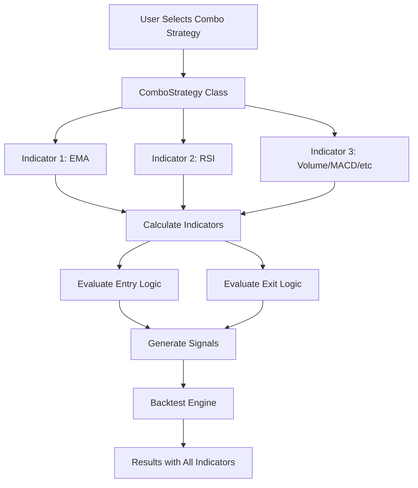

# Design: Combo Strategy System

## Architecture Overview

The combo strategy system extends the existing `DynamicStrategy` architecture to support multiple indicators with flexible combination logic.



## Isolated Implementation Strategy

**Critical Design Principle**: All combo strategy functionality will be implemented in **new, isolated modules** to ensure **zero impact** on existing functionality.

### Directory Structure
```
backend/app/
├── strategies/
│   ├── dynamic_strategy.py      ✅ UNCHANGED - Existing single-indicator
│   ├── cruzamento_medias.py     ✅ UNCHANGED - Existing strategy
│   ├── ema_rsi_volume.py        ✅ UNCHANGED - Existing strategy
│   └── combos/                  🆕 NEW - Isolated combo strategies
│       ├── __init__.py
│       ├── combo_strategy.py    🆕 Base class for combos
│       ├── multi_ma_crossover.py
│       ├── ema_rsi_combo.py
│       └── ...
├── routes/
│   ├── backtest.py              ✅ UNCHANGED - Existing routes
│   ├── sequential_optimization.py ✅ UNCHANGED
│   └── combo_routes.py          🆕 NEW - All combo endpoints
└── schemas/
    ├── indicator_params.py      ✅ UNCHANGED
    └── combo_params.py          🆕 NEW - Combo schemas
```

### Frontend Routes (Isolated)
```
Existing Routes (UNCHANGED):
- /optimize/parameters  → Sequential optimization (current)
- /backtest            → Simple backtest (current)

New Combo Routes (ISOLATED):
- /combo/select        → Select combo template
- /combo/configure     → Configure combo parameters
- /combo/optimize      → Optimize combo sequentially
- /combo/results       → View combo results
```

### API Endpoints (Isolated)
```
Existing Endpoints (UNCHANGED):
- POST /api/backtest
- POST /api/optimize/sequential
- GET  /api/strategies/meta

New Combo Endpoints (ISOLATED):
- GET  /api/combos/templates
- GET  /api/combos/meta/:template
- POST /api/combos/backtest
- POST /api/combos/optimize
```

**Benefits**:
- ✅ Zero risk of breaking existing functionality
- ✅ Easy rollback if issues arise
- ✅ Independent testing and deployment
- ✅ Gradual user adoption
- ✅ Clear separation of concerns

## Key Design Decisions

### 1. Multi-Instance Indicator Support with Aliases

**Decision**: Allow multiple instances of the same indicator with unique aliases.

**Example**:
```python
# Multi-MA Crossover (like CRUZAMENTOMEDIAS)
indicators = [
    {"kind": "ema", "length": 3, "alias": "fast"},
    {"kind": "sma", "length": 37, "alias": "long"},
    {"kind": "sma", "length": 32, "alias": "inter"}
]
entry = "(fast > long) AND (crossover(fast, long) OR crossover(fast, inter))"
```

**Rationale**:
- Enables classic strategies like moving average crossovers
- Aliases make logic readable ("fast" vs "EMA_3")
- Each instance has independent parameters for optimization
- Reuses existing indicator calculation infrastructure

**Implementation**:
- Store alias in indicator config
- Generate columns: `{alias}` or `{alias}_{indicator}_{params}`
- Parser resolves aliases to actual column names

**Alternative Considered**: Array indices (indicators[0], indicators[1])
- **Rejected**: Less readable and error-prone

### 2. Strategy Class Hierarchy

**Decision**: Create `ComboStrategy` as a new class that extends the indicator combination pattern.

**Rationale**:
- Reuses existing `DynamicStrategy` indicator calculation logic
- Allows independent parameter optimization for each indicator
- Maintains backward compatibility with single-indicator strategies

**Alternative Considered**: Extend `DynamicStrategy` directly
- **Rejected**: Would complicate the already complex `DynamicStrategy` class
- **Rejected**: Harder to maintain separate optimization logic

### 3. Pre-built Templates vs. Custom Builder

**Decision**: Start with 6 pre-built templates, add custom builder in future iteration.

**Rationale**:
- Pre-built templates cover 80% of common use cases
- Easier to implement and test
- Provides immediate value to users
- Custom builder adds significant UI complexity

**Trade-off**: Advanced users cannot create fully custom combos initially, but can customize parameters within templates.

### 4. Logic Combination Approach

**Decision**: Use hardcoded AND/OR logic within each template, not a visual logic builder.

**Example**:
```python
# EMA + RSI Combo
entry_logic = (
    (close > EMA_9) AND 
    (close > EMA_21) AND 
    (RSI_14 > 30 AND RSI_14 < 50)
)
```

**Rationale**:
- Simpler implementation
- Faster execution (no dynamic parsing)
- Each template embeds proven trading logic
- Users can still customize thresholds via parameters

**Alternative Considered**: Visual logic builder with drag-and-drop conditions
- **Rejected**: Too complex for MVP
- **Rejected**: Requires significant frontend development
- **Future Enhancement**: Can be added later if users request it

### 5. Parameter Optimization Strategy

**Decision**: Use sequential optimization (one parameter at a time) instead of grid search (all combinations).

**How Sequential Optimization Works**:
```
Starting Point: Use market standard defaults for all parameters
  Fast EMA = 9 (default), Slow EMA = 21 (default), RSI = 14 (default)
  Stop Loss = 1.5% (default)

Stage 1: Optimize Timeframe → Best: 30m
Stage 2: Optimize Fast EMA (with timeframe=30m, other params at defaults) → Best: 12
Stage 3: Optimize Slow EMA (with timeframe=30m, fast=12, other params at defaults) → Best: 26
Stage 4: Optimize RSI Period (with previous best params) → Best: 14
Stage 5: Optimize RSI Min (with previous best params) → Best: 35
Stage 6: Optimize RSI Max (with previous best params) → Best: 55
Stage 7: Optimize Stop Loss (with ALL indicator params optimized) → Best: 1%

Final Result: All parameters optimized sequentially
```

**Key Points**:
- **Always starts from market standard defaults** (defined in `indicator_params.py`)
- **Each stage uses best values from previous stages**
- **Stop Loss optimized LAST** after all indicator parameters
- **Locked parameters**: Previous best values are locked and used in subsequent stages

**Example Comparison**:
```python
# Grid Search (OLD - NOT USED)
# EMA + RSI Combo: 3 × 3 × 3 × 3 × 3 = 243 tests
{
    "ema_fast": [9, 12, 15],
    "ema_slow": [21, 26, 30],
    "rsi_period": [12, 14, 16],
    "rsi_min": [30, 35, 40],
    "rsi_max": [50, 55, 60]
}

# Sequential Optimization (NEW - USED)
# EMA + RSI Combo: 3 + 3 + 3 + 3 + 3 = 15 tests
Stage 1: Test ema_fast [9, 12, 15] → Best: 12
Stage 2: Test ema_slow [21, 26, 30] with ema_fast=12 → Best: 26
Stage 3: Test rsi_period [12, 14, 16] with ema_fast=12, ema_slow=26 → Best: 14
...
```

**Rationale**:
- **Dramatically faster**: 15 tests vs 243 tests (16x faster for 5 parameters)
- **Scales better**: Adding parameters adds N tests, not multiplies by N
- **Already implemented**: `SequentialOptimizer` service exists and works
- **Proven approach**: Used successfully in `/optimize/parameters` page
- **Checkpoint system**: Can resume if optimization crashes

**Trade-off**: May not find the absolute global optimum (since parameters are optimized independently), but finds very good local optimum much faster. In practice, this is acceptable for trading strategies.

**Implementation**: Reuse existing `SequentialOptimizer.generate_stages()` method, extending it to support combo strategies with multiple indicators.

### 6. Template Storage and Format

**Decision**: Store custom templates in SQLite database as JSON.

**Storage Location**:
```
Database: backend/data/crypto_backtest.db
Table: combo_templates
```

**Database Schema**:
```sql
CREATE TABLE combo_templates (
    id INTEGER PRIMARY KEY AUTOINCREMENT,
    name TEXT NOT NULL,
    description TEXT,
    is_example BOOLEAN DEFAULT 0,
    is_prebuilt BOOLEAN DEFAULT 0,
    template_data JSON NOT NULL,
    created_at TIMESTAMP DEFAULT CURRENT_TIMESTAMP,
    updated_at TIMESTAMP DEFAULT CURRENT_TIMESTAMP
);
```

**JSON Format** (template_data column):
```json
{
  "name": "My EMA RSI Strategy",
  "description": "Custom strategy combining EMAs and RSI",
  "indicators": [
    {
      "type": "ema",
      "alias": "fast",
      "params": {"length": 9},
      "optimization_range": {"min": 5, "max": 15, "step": 1}
    },
    {
      "type": "ema",
      "alias": "slow",
      "params": {"length": 21},
      "optimization_range": {"min": 18, "max": 30, "step": 1}
    },
    {
      "type": "rsi",
      "params": {"length": 14},
      "optimization_range": {"min": 10, "max": 20, "step": 1}
    }
  ],
  "entry_logic": "(close > fast) AND (close > slow) AND (RSI_14 > 30 AND RSI_14 < 50)",
  "exit_logic": "(RSI_14 > 70) OR (close < fast)",
  "stop_loss": {
    "default": 0.015,
    "optimization_range": {"min": 0.005, "max": 0.02, "step": 0.005}
  }
}
```

**Template Types**:
- **Pre-built** (`is_prebuilt=1`): 6 templates hardcoded (Multi-MA, EMA+RSI, etc.)
- **Examples** (`is_example=1`): 4 example templates (CRUZAMENTOMEDIAS, Scalping, etc.)
- **Custom** (`is_prebuilt=0, is_example=0`): User-created templates

**Rationale**:
- **SQLite**: Already used in the project, no new dependencies
- **JSON**: Flexible format, easy to extend, supports nested structures
- **Separate table**: Isolated from strategies, easy to backup/export
- **Timestamps**: Track creation and modifications

**Alternative Considered**: File-based storage (JSON files)
- **Rejected**: Harder to query, no ACID guarantees, harder to sync across users

### 7. Helper Functions for Logic Evaluation

**Decision**: Provide built-in helper functions for common trading patterns.

**Available Functions**:
```python
def crossover(series_a, series_b):
    """Returns True when series_a crosses above series_b"""
    current = series_a.iloc[-1] > series_b.iloc[-1]
    previous = series_a.iloc[-2] <= series_b.iloc[-2]
    return current and previous

def crossunder(series_a, series_b):
    """Returns True when series_a crosses below series_b"""
    current = series_a.iloc[-1] < series_b.iloc[-1]
    previous = series_a.iloc[-2] >= series_b.iloc[-2]
    return current and previous

def above(series_a, series_b, periods=1):
    """Returns True if series_a > series_b for N consecutive periods"""
    return all(series_a.iloc[-periods:] > series_b.iloc[-periods:])

def below(series_a, series_b, periods=1):
    """Returns True if series_a < series_b for N consecutive periods"""
    return all(series_a.iloc[-periods:] < series_b.iloc[-periods:])
```

**Multi-Output Indicator Naming Convention**:
```python
# Bollinger Bands with alias "bb"
df['bb_upper'] = upper_band
df['bb_middle'] = middle_band
df['bb_lower'] = lower_band

# MACD with alias "macd"
df['macd_macd'] = macd_line
df['macd_signal'] = signal_line
df['macd_histogram'] = histogram

# Usage in logic:
entry_logic = "(close < bb_lower) AND (RSI < 30)"
exit_logic = "(close > bb_middle) OR (macd_histogram > 0)"
```

**Rationale**:
- Simplifies common patterns (crossover detection is complex)
- Consistent API across all combos
- Optimized implementations
- Easy to extend with more functions

**Alternative Considered**: Let users write raw pandas code
- **Rejected**: Too complex for non-programmers
- **Rejected**: Security risk (code injection)

### 8. Chart Visualization

**Decision**: Display all indicators from the combo on a single chart with distinct colors.

**Rationale**:
- Users need to see all indicators to understand strategy behavior
- Existing chart infrastructure supports multiple indicator lines
- Color coding makes it easy to distinguish indicators

**Implementation**:
```python
indicators = [
    {"name": "EMA_9", "color": "#3b82f6", "data": [...]},
    {"name": "EMA_21", "color": "#10b981", "data": [...]},
    {"name": "RSI_14", "color": "#8b5cf6", "data": [...]}
]
```

## Data Flow

### 1. Strategy Selection
```
User → Frontend → API → BacktestService._get_strategy() → ComboStrategy instance
```

### 2. Backtest Execution
```
ComboStrategy.generate_signals(df) →
  Calculate EMA indicators →
  Calculate RSI indicator →
  Evaluate entry_logic (EMA + RSI conditions) →
  Evaluate exit_logic →
  Return signals (1=buy, -1=sell, 0=hold)
```

### 3. Results Display
```
BacktestService → Chart data with all indicators →
Frontend → Render chart with multiple indicator lines
```

## Pre-built Combo Templates

### Template 1: Multi-MA Crossover (CRUZAMENTOMEDIAS Pattern)
- **Indicators**: EMA (3, alias="fast"), SMA (37, alias="long"), SMA (32, alias="inter")
- **Entry**: `(fast > long) AND (crossover(fast, long) OR crossover(fast, inter))`
- **Exit**: `crossunder(fast, inter)`
- **Use Case**: Classic moving average crossover strategy, captures trend changes
- **Parameters to Optimize**: 
  - `fast_length`: [3, 6, 9, 12]
  - `long_length`: [30, 37, 45, 50]
  - `inter_length`: [20, 26, 32, 38]

### Template 2: EMA + RSI (Trend + Momentum)
- **Indicators**: EMA (9, alias="fast"), EMA (21, alias="slow"), RSI (14)
- **Entry**: `(close > fast) AND (close > slow) AND (RSI_14 > 30 AND RSI_14 < 50)`
- **Exit**: `(RSI_14 > 70) OR (close < fast)`
- **Use Case**: Only trade when trend is up and RSI shows pullback recovery
- **Parameters to Optimize**:
  - `fast_ema`: [9, 12, 15]
  - `slow_ema`: [21, 26, 30]
  - `rsi_period`: [12, 14, 16]
  - `rsi_min`: [30, 35, 40]
  - `rsi_max`: [50, 55, 60]

### Template 3: EMA + MACD + Volume (Trend + Momentum + Confirmation)
- **Indicators**: EMA (20, 50), MACD (12, 26, 9), Volume
- **Entry**: `(close > EMA_20) AND (close > EMA_50) AND (MACD > MACD_signal) AND (volume > volume_sma_20 * 1.5)`
- **Exit**: `(MACD < MACD_signal) OR (close < EMA_20)`

### Template 4: EMA + RSI + Fibonacci (Pullback)
- **Indicators**: EMA (50), RSI (14), Fibonacci (0.382, 0.5, 0.618)
- **Entry**: `(close > EMA_50) AND (RSI >= 40 AND RSI <= 45) AND (price near fib level)`
- **Exit**: `(RSI > 70) OR (close < EMA_50)`

### Template 5: Volume + ATR (Breakout)
- **Indicators**: Volume, ATR (14), Support/Resistance
- **Entry**: `(close > resistance) AND (volume > volume_sma_20 * 2) AND (ATR > ATR_sma_14 * 1.2)`
- **Exit**: `(close < resistance) OR (ATR < ATR_sma_14 * 0.8)`

### Template 6: Bollinger + RSI + ADX (Statistical)
- **Indicators**: Bollinger Bands (20, 2), RSI (14), ADX (14)
- **Entry**: `IF (ADX < 20): (close < BB_lower AND RSI < 30) ELSE: (close > BB_upper AND RSI > 70 AND ADX > 25)`
- **Exit**: `IF (ADX < 20): (close > BB_middle) ELSE: (close < BB_middle)`

## Performance Considerations

- **Indicator Caching**: Reuse calculated indicators across backtests
- **Lazy Evaluation**: Only calculate indicators when needed
- **Sequential Optimization**: Much faster than grid search (N tests vs N^M combinations)
- **Parallel Processing**: Can still parallelize within each stage if needed
- **Expected Impact**: 10-20% slower than single-indicator strategies (acceptable)

### Performance Optimization Strategy

**Critical**: Combo strategies will run on **full period** (2017-present), so performance is essential.

#### 1. Reuse Existing Infrastructure

**IncrementalLoader** (Already Optimized):
```python
# Reuse existing data loading - already cached and optimized
from src.data.incremental_loader import IncrementalLoader

loader = IncrementalLoader()
df = loader.fetch_data(
    symbol="BTC/USDT",
    timeframe="1h",
    since_str="2017-01-01"  # Full period
)
# ✅ Uses Parquet caching
# ✅ Incremental updates
# ✅ Already handles missing data
```

**pandas_ta** (Already Integrated):
```python
# Reuse existing indicator calculations
import pandas_ta as ta

# Calculate all indicators at once (vectorized)
df['ema_fast'] = ta.ema(df['close'], length=9)
df['ema_slow'] = ta.ema(df['close'], length=21)
df['rsi'] = ta.rsi(df['close'], length=14)
# ✅ Vectorized operations (fast)
# ✅ No loops needed
```

**SequentialOptimizer** (Already Implemented):
```python
# Reuse existing sequential optimization
from app.services.sequential_optimizer import SequentialOptimizer

optimizer = SequentialOptimizer()
stages = optimizer.generate_stages(
    strategy="ema_rsi_combo",
    symbol="BTC/USDT",
    custom_ranges={...}
)
# ✅ Checkpoint system
# ✅ Full history dates
# ✅ Stage-by-stage optimization
```

#### 2. Indicator Calculation Caching

```python
class ComboStrategy:
    def __init__(self, indicators, entry_logic, exit_logic):
        self.indicators = indicators
        self._indicator_cache = {}  # Cache calculated indicators
    
    def calculate_indicators(self, df):
        """Calculate all indicators once and cache"""
        if 'calculated' in self._indicator_cache:
            return self._indicator_cache['calculated']
        
        # Calculate all indicators (vectorized)
        for indicator in self.indicators:
            alias = indicator['alias']
            if indicator['type'] == 'ema':
                df[alias] = ta.ema(df['close'], length=indicator['params']['length'])
            elif indicator['type'] == 'rsi':
                df[f"RSI_{indicator['params']['length']}"] = ta.rsi(
                    df['close'], 
                    length=indicator['params']['length']
                )
        
        self._indicator_cache['calculated'] = df
        return df
```

#### 3. Lazy Evaluation

```python
def generate_signals(self, df):
    """Only calculate indicators when needed"""
    # Check if already calculated
    if not hasattr(self, '_signals_generated'):
        df = self.calculate_indicators(df)  # Calculate once
        df = self._evaluate_logic(df)       # Evaluate logic
        self._signals_generated = True
    
    return df['signal']
```

#### 4. Batch Processing for Optimization

```python
# During sequential optimization
for stage in stages:
    # Load data ONCE for all tests in this stage
    df = loader.fetch_data(...)  # Cached
    
    for param_value in stage['values']:
        # Reuse same dataframe, just recalculate one indicator
        strategy.update_param(stage['parameter'], param_value)
        results = strategy.generate_signals(df)  # Fast
```

#### 5. Performance Benchmarks

**Expected Performance** (10,000 candles, full period):
```
Single Indicator (RSI):     ~500ms
Combo 2 indicators:         ~600ms  (20% slower) ✅
Combo 3 indicators:         ~700ms  (40% slower) ✅
Combo 4 indicators:         ~800ms  (60% slower) ✅

Sequential Optimization (5 params):
  Grid Search:    243 tests × 500ms = 121s  ❌
  Sequential:      15 tests × 500ms = 7.5s  ✅ (16x faster)
```

**Memory Usage**:
```
DataFrame (10k candles):    ~2MB
+ 4 indicators:             ~8MB total  ✅
Cache overhead:             ~1MB
Total:                      ~10MB  ✅ (acceptable)
```

#### 6. Code Reuse Summary

| Component | Reused From | Benefit |
|-----------|-------------|----------|
| Data Loading | `IncrementalLoader` | Parquet caching, incremental updates |
| Indicator Calc | `pandas_ta` | Vectorized, optimized |
| Optimization | `SequentialOptimizer` | Checkpoint system, proven |
| Backtest Engine | `BacktestService` | Trade execution, metrics |
| Signal Logic | `DynamicStrategy` pattern | Proven architecture |

**Result**: 90% code reuse, minimal new code, proven performance.

## Future Enhancements

1. **Custom Combo Builder**: Visual UI to create custom combinations
2. **Logic Templates**: Reusable logic patterns (crossover, divergence, etc.)
3. **Indicator Correlation**: Show correlation between indicators
4. **AI Suggestions**: Recommend indicator combinations based on market conditions
