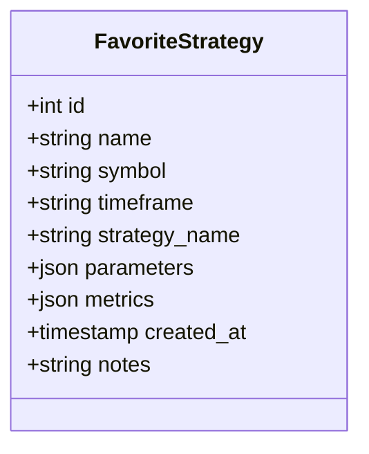

# Design

## Database Schema
We will use a relational model stored in SQLite. The `FavoriteStrategy` table serves as the single source of truth.

## API Design
RESTful design principles applied:

-   `GET /api/favorites`: Returns list of favorites (lightweight, potentially excluding large `trades` arrays if we decide to store them).
-   `POST /api/favorites`: Accepts the full configuration state.
-   `DELETE /api/favorites/{id}`: Soft or hard delete.

## Parameter Versioning
To mitigate the risk of schema evolution (e.g., a strategy changes its parameter names), the `parameters` column is a loosely structured JSON. The execution engine (Simulating Service) should implement a "best-effort" mapping or validation step when loading a favorite:
1.  Load favorite JSON.
2.  Compare keys against current strategy schema.
3.  Warn user or fill defaults for missing keys.

## Frontend State Management
-   **Dashboard**: Fetches list on mount.
-   **Execution**: On "Run", we do not simpler POST to execution execution. Instead, we use React Router to navigate to `/backtest` or `/optimize` utilizing query parameters or context state (e.g., `location.state`) to pre-fill the form. This avoids duplicating the execution logic in the Favorites API.
