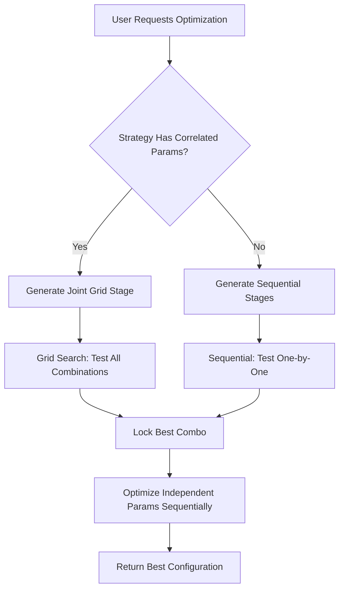

# Design: Hybrid Grid Optimization

## Architecture Overview



## Key Design Decisions

### 1. Correlation Detection Strategy

**Option A: Hardcoded Strategy Rules** ✅ **CHOSEN**
```python
if strategy == "cruzamentomedias":
    correlated_groups = [["media_curta", "media_inter", "media_longa"]]
```

**Rationale:**
- Simple, explicit, maintainable
- Each strategy knows its own parameter relationships
- Easy to extend for new strategies

**Option B: Schema Metadata** (Future Enhancement)
```python
CRUZAMENTOMEDIAS_SCHEMA = {
    "correlation_groups": [["media_curta", "media_inter", "media_longa"]]
}
```

### 2. Grid Size Management

**Challenge:** Full grid can explode (e.g., 10×10×10×50 = 50,000 tests)

**Solution:** Tiered Grid Density
- **Correlated Params (MAs):** Moderate density (step=2-5)
  - `media_curta`: 3, 5, 7, 9, 11, 13, 15 (7 values)
  - `media_inter`: 15, 19, 23, 27, 31, 35 (6 values)  
  - `media_longa`: 25, 30, 35, 40, 45, 50, 55, 60 (8 values)
  - **Grid Size:** 7 × 6 × 8 = **336 combinations**

- **Independent Params (Stop Loss):** High density (step=0.002)
  - After finding best MA combo, test 63 stop_loss values
  - **Total:** 336 + 63 = **399 tests** (~5 min @ 1 test/sec)

### 3. Stage Execution Flow

**Current (Sequential):**
```
Stage 1: Timeframe [7 tests]
Stage 2: media_curta [13 tests] ← Locks best=19 (with default inter/longa)
Stage 3: media_inter [21 tests] ← Tests with curta=19 (locked)
Stage 4: media_longa [36 tests] ← Tests with curta=19, inter=21 (locked)
Stage 5: stop_loss [63 tests]
Total: 140 tests, MISSES "Antiga" ❌, Uses SIMPLE backtest
```

**Proposed (Hybrid + Deep):**
```
Stage 1: Timeframe [7 tests] ← Deep Backtest 15m
Stage 2: MA Combo Grid [336 tests] ← Deep Backtest 15m, FINDS "Antiga" ✅
Stage 3: stop_loss [63 tests] ← Deep Backtest 15m (accurate stop validation)
Total: 406 tests, Deep Mode enabled
```

### 4. Deep Backtest Integration

**Configuration:**
```python
# In SequentialOptimizer.run_stage()
config = {
    "exchange": "binance",
    "symbol": symbol,
    "timeframe": test_params.get("timeframe", "1h"),
    "strategies": [strategy],
    "since": start_date,
    "until": end_date,
    "params": {strategy: test_params},
    "mode": "run",
    "cash": 10000,
    "stop_pct": test_params.get("stop_loss"),
    "take_pct": test_params.get("stop_gain"),
    # NEW: Deep Backtest flags
    "use_deep_backtest": True,           # ← Enable 15m validation
    "intraday_timeframe": "15m"          # ← Granularity for stop checks
}
```

**Benefits:**
- **Realistic Stop Loss**: Detects intraday hits (e.g., stop at 2.7% triggered mid-day)
- **Accurate Metrics**: Win rate, drawdown reflect actual execution
- **No Extra Cost**: 15m data already cached from previous runs

### 4. Deep Backtest Integration

**Already Implemented in Combo Optimizer:**
```python
# In ComboOptimizer.run_optimization()
def run_optimization(
    self,
    template_name: str,
    symbol: str,
    timeframe: str = "1h",
    start_date: Optional[str] = None,
    end_date: Optional[str] = None,
    custom_ranges: Optional[Dict[str, Any]] = None,
    deep_backtest: bool = True,  # ← Already defaults to True
    job_id: Optional[str] = None
)
```

**No Changes Needed:**
- Deep Backtest is already enabled by default
- All tests use 15m intraday validation
- Stop-loss accuracy is already realistic

### 5. Iterative Refinement Integration

**Current Behavior (Problem):**
```python
# ComboOptimizer runs 5 rounds of refinement
max_rounds = 5
while not converged and round_num <= max_rounds:
    for stage in stages:
        # Tests each param with best values from previous round
        # Problem: Would re-test 336 MA combos × 5 rounds = 1,680 tests (wasteful)
```

**Proposed Behavior (Solution):**
```python
# Detect if any stage uses Grid Search
has_grid_search = any(stage.get('grid_mode') for stage in stages)

if has_grid_search:
    # Disable refinement when Grid is active
    max_rounds = 1
    logging.info("Grid Search detected - running single round (no refinement)")
else:
    # Normal refinement for sequential optimization
    max_rounds = 5

# Execute optimization
for round_num in range(1, max_rounds + 1):
    for stage in stages:
        if stage.get('grid_mode'):
            # Execute Grid Search (test all combinations)
            grid_results = execute_grid_search(stage)
            best_params.update(grid_results['best_combo'])
        else:
            # Normal sequential optimization (stop_loss, etc.)
            sequential_results = execute_sequential(stage)
            best_params.update(sequential_results)
```

**Benefits:**
- Grid finds global max in single round (336 tests)
- Stop loss optimized with winning combo (63 tests)
- Total: 336 + 63 = **399 tests** (~5-10 min)
- vs. Old approach: 336 × 5 = 1,680 tests (~40 min) for same result

**Why No Refinement Needed:**
Grid Search **guarantees** finding the global maximum within the search space. Refinement is only useful for sequential optimization (which can get stuck in local maxima). Since Grid tests ALL combinations, there's nothing to refine.

### 6. Grid Size Validation

**Risk:** User configures overly broad ranges → Grid explodes

**Example Problem:**
```python
custom_ranges = {
    "media_curta": {"min": 1, "max": 100, "step": 1},   # 100 values
    "media_inter": {"min": 1, "max": 100, "step": 1},   # 100 values
    "media_longa": {"min": 1, "max": 100, "step": 1}    # 100 values
}
# Grid size: 100 × 100 × 100 = 1,000,000 combinations
# Time: ~14 days at 1s/test
```

**Solution: Pre-flight Validation**
```python
def _calculate_grid_size(self, stage):
    if not stage.get('grid_mode'):
        return len(stage['values'])
    
    # Calculate product of all value list sizes
    grid_size = 1
    for value_list in stage['values']:
        grid_size *= len(value_list)
    
    # Validate against limit
    MAX_GRID_SIZE = 1000
    if grid_size > MAX_GRID_SIZE:
        logging.warning(
            f"Grid size ({grid_size:,}) exceeds recommended limit ({MAX_GRID_SIZE:,}). "
            f"Estimated time: ~{grid_size * 2 / 3600:.1f} hours. "
            f"Consider increasing step size or reducing range."
        )
    
    return grid_size
```

**User Experience:**
```
WARNING: Grid size (125,000) exceeds recommended limit (1,000)
SUGGESTION: Increase step size from 1 to 5 (reduces to 8,000 combinations)
PROCEEDING: Optimization will take ~70 hours. Press Ctrl+C to cancel.
```

### Stage Config (Extended)
```python
{
    "stage_num": 2,
    "stage_name": "Moving Averages Combo",
    "parameter": ["media_curta", "media_inter", "media_longa"],  # List = Joint
    "values": [
        [3, 5, 7, 9, 11, 13, 15],           # media_curta options
        [15, 19, 23, 27, 31, 35],           # media_inter options
        [25, 30, 35, 40, 45, 50, 55, 60]    # media_longa options
    ],
    "locked_params": {"timeframe": "1d"},
    "description": "Joint optimization of all 3 moving averages"
}
```

### Result Storage
```python
{
    "params": {
        "media_curta": 3,
        "media_inter": 32,
        "media_longa": 37,
        "timeframe": "1d"
    },
    "metrics": {"total_pnl": 1334.53, ...},
    "test_num": 150,
    "total_tests": 336
}
```

## Performance Considerations

- **Memory:** Grid iterator uses generator (`itertools.product`) - O(1) memory
- **Disk I/O:** Checkpoint after each test (same as current)
- **Network:** No change (same backtest API calls)
- **Time Complexity:** O(n₁ × n₂ × n₃) for grid, O(n₁ + n₂ + n₃) for sequential
  - Example: 336 vs 70 tests for MAs, but finds global max

## Backward Compatibility

- Strategies without correlated params use existing sequential logic
- No API changes required
- Checkpoint format extended, but backward-compatible (new field ignored by old code)

## Future Enhancements

1. **Adaptive Grid Refinement:** After coarse grid, zoom into promising regions
2. **Parallel Execution:** Run grid tests in parallel (requires async backtest)
3. **Smart Sampling:** Use Bayesian optimization to reduce grid size
4. **User-Defined Groups:** Allow custom correlation groups via UI
