# Design: card-582-palestra-upstream-deploy

Este arquivo é o **refinamento do card #582**. O issue veio primeiro; o Dev implementa **a partir daqui** (Gist). Tudo que o card exige para aplicar está abaixo (superset do issue). `/opsx:apply` NÃO usa o body do GitHub como spec paralela.

## UI impact

`none` — palestra e docs em `docs/`. Sem superfície visual do produto. **Não** autoriza pular `Design` / `Aprovação de Design` / `Pronto para Dev`. Pedido no chat `implemente o card 582` **não** autoriza pular este gate.

## Prototype

**N/A** — sem UI de produto. O deck Markdown não é protótipo de tela do app; não publica `frontend/public/prototypes/`. Card exemplo #585 também é `UI impact: none` (sem protótipo HTTP).

## Impeccable Brief

**N/A** — `UI impact: none`. Sem pipeline visual de produto.

## Impeccable Critique

**N/A** — `UI impact: none`.

## Impeccable Audit

**N/A** — `UI impact: none`.

## Impeccable Trace

**N/A** — `UI impact: none`.

## Context

- Issue: [#582](https://github.com/oalansilva/crypto/issues/582)
- Status do board: **Aprovação de Design** (Project 1, item `PVTI_lAHOAAHtBM4BV8b2zg20dL4`). Alan confirmou no chat (2026-08-17): o destino é o **Agile Brazil 2026**.
- Evento: [agilebrazil.com/2026](https://www.agilebrazil.com/2026/) · Foz do Iguaçu (1ª vez na tríplice fronteira) · **12 e 13 de novembro de 2026** (comunicado oficial Agile Brazil) · hotel/venue Grand Carimã no site.
- Público: comunidade de agilidade, produto e inovação (~800 participantes nas edições recentes, texto “Sobre” do site). Não é reunião interna.
- CFP: página `/submissao-palestra` do site — **“A submissão de palestra e workshop encerradas dia 26 de julho!”**. Este card entrega o **pacote da palestra** (deck + notas), não uma nova submissão Even3.
- Já existe: roteiro no corpo do issue; bloco projetor `docs/palestra-upstream-deploy-slide-skills.md` (13 slides + backup).
- Falta: deck dos demais blocos; mapa/screenshot do board; exemplo de card com Gist + evidência; enquete com contagem ao vivo; Google Slides; ensaio cronometrado (entregável humano).
- Fontes canônicas do caso **atual**: `AGENTS.md`, `rules.md`, `.cursor/skills/` (GitHub, pós-#585), `.agents/skills/`.
- Change: `card-582-palestra-upstream-deploy`
- Gist: `https://gist.github.com/oalansilva/ce8aaaef5f0c4f82c5427f9006db4158` (republicar o mesmo; sem sprawl)
- Worktree: `/srv/apps/dev/criptofarol/crypto-worktrees/card-582-palestra-upstream-deploy` a partir de `origin/develop`.
- WIP `#584` na source DEV: **preservar, não tocar**. #584 foi substituído pelo #585 (Pronto); não citar `#584` como canônico.

## Roteiro a transcrever (superset — não reinventar tese)

O apply SHALL copiar/adaptar este conteúdo para slides. Não inventar outra mensagem central.

**Evento:** Agile Brazil 2026 · Foz do Iguaçu · 12–13 nov 2026 · https://www.agilebrazil.com/2026/  
**Título:** Do upstream ao deploy: como automatizar o downstream sem remover os gates humanos  
**Caso:** Cripto Farol (fluxo atual, agosto/2026) — relato de experiência, não pitch comercial  
**Apresentador:** Alan  
**Duração:** 30 min, 7 blocos (cabe em sessão clássica de palestra; Q&A no bloco final)

**Tom para a plateia:** coaches, Scrum Masters, PMs, leads de engenharia. Traduzir jargão interno (OpenSpec, Pronto para Dev, release-guard, HITL) na primeira ocorrência. Cripto Farol é o **caso**; o takeaway é o modelo replicável (7 pontos) com **human-in-the-loop** como espinha: o agente não substitui o humano nos quatro gates.

**Mensagem central:** automatizar *transições verificáveis* e *evidência*; **human-in-the-loop** nas decisões de julgamento — triagem, design, homologação funcional, autorização de produção. HITL não é burocracia: é o humano onde o custo de errar é irreversível; a máquina onde o critério é auditável.

**Tese HITL (Alan, 2026-08-17 — obrigatória no deck, não rodapé):**

Automação de agentes sem gates humanos vira autonomia sem accountability. O chat (`implemente`) não é aprovação. Skills/CI/Playwright **não** substituem o humano; elas *codificam* o que o agente pode fazer **entre** os gates.

| Gate | Humano decide | Por que o agente não cruza |
| --- | --- | --- |
| **0** Em Refinamento → Todo | O que entra no backlog (priorizar ou cancelar) | O agente trabalharia tudo; prioridade é aposta humana |
| **1** Aprovação de Design → Pronto para Dev | Se é a coisa certa a construir | O agente otimiza o prompt, não o usuário |
| **2** Done → Homologado | Se funciona para quem pediu (teste em develop) | Teste verde ≠ julgamento de produto |
| **3** Homologado → Pronto | Se pode ir a produção | Merge em `main` ≠ operação; raio de explosão é humano |

Frase de slide: **Automatize o verificável. Reserve o humano para o irreversível.**

**Modelo replicável (7 pontos):**

1. Fonte única de estado — campo `Status` do board (não chat, não memória do agente)
2. Contrato entre etapas — OpenSpec + checklist por coluna
3. Skills como runbooks — instrução versionada, não prompt ad hoc
4. Transições verificáveis — gates bloqueiam sem artefato/teste/evidência
5. Limites de autonomia — WIP, locks, quem pode mover o quê
6. Quatro gates humanos que o agente nunca cruza
7. Papéis nomeados — 6 agentes no mesmo harness (`inherit`) + Alan

**Estrutura 30 min:**

| Tempo | Bloco | Conteúdo |
| --- | --- | --- |
| 0–3 min | Enquete | Onde trava hoje (6 opções + contagem ao vivo) |
| 3–7 min | Problema downstream | Código ≠ valor entregue; custo na coordenação |
| 7–11 min | Anatomia + HITL | Fonte única, 6 papéis, **por que** os 4 gates (tabela humano vs agente) |
| 11–14 min | Skills como runbooks | Arquivo `docs/palestra-upstream-deploy-slide-skills.md` (referência, sem duplicar) |
| 14–20 min | Caso Cripto Farol | 12 colunas + 4 gates no fluxo + três trilhas |
| 20–25 min | Falhas reais | Bypass de HITL (chat “implemente”, merge≠Pronto) + demais do issue |
| 25–30 min | Modelo + Q&A | Checklist + pergunta: onde o humano ainda precisa estar no *seu* fluxo? |

**Enquete (6 opções) + contagem ao vivo:**  
Opções: (1) triagem/refinamento (2) design (3) dev (4) code review (5) QA (6) homologação ou produção.  
Mecânica: o apresentador lê as opções; a plateia vota **mão no ar** (sala) ou **número no chat** (remoto); Alan anota a contagem no slide/quadro ao vivo. Sem app obrigatório.

**Três trilhas (bloco 14–20):**

```text
Trilha OpenSpec:
/opsx:new → /opsx:ff → publicar Gist no card
  → design-critic [+ impeccable se UI]
  → Alan: Aprovação de Design → Pronto para Dev
  → /opsx:apply → /opsx:verify
  → /opsx:archive (ou bulk-archive no release)

Trilha técnica (card):
branch card-<id>-<slug> a partir de develop
  → Pronto para Dev → Em desenvolvimento → Code Review (diff exato)
  → QA (qa-gate + Playwright visual) → PR → develop → ./restart
  → validar URL DEV → Done técnico (NÃO é produção)
  → Alan testa em develop → Homologado

Trilha de release:
cards Homologado no pacote
  → release-guard pre → openspec validate --all
  → /opsx:bulk-archive → PR develop→main → merge manual
  → deploy PROD (alan-workflow-ambientes)
  → /kaizen release + docs/release-<data>.md + kaizen-log
  → release-guard post (RELEASE_CARDS, RELEASE_BRANCHES, PROD_DEPLOY_EVIDENCE)
  → somente após PASS → Pronto
```

**Regra de ouro:** merge em `main` **não** autoriza `Pronto` sem deploy PROD validado.

**Quatro gates humanos:**

| # | Gate | Quem |
| --- | --- | --- |
| 0 | Em Refinamento → Todo | Alan (prioriza ou cancela) |
| 1 | Aprovação de Design → Pronto para Dev | Alan |
| 2 | Done → Homologado | Alan testa develop |
| 3 | Homologado → Pronto | Alan / release com evidência |

**Papéis:** main, PO, DESIGN, DEV, QA, Kaizen + Alan. Não são 6 modelos; mesmo Cursor Agent, `inherit`.

**Skills path canônico (sanitizar):** nos slides **novos**, workflow global é `.cursor/skills/alan-workflow` (+ ambientes, github-project-board). **Proibido** transcrever `~/.codex/skills/` do body antigo do issue como contrato atual. O issue ainda contém esse path obsoleto; o deck corrige.

**Slide-chave (mermaid — copiar para o deck):**

```mermaid
flowchart LR
  subgraph intake [Entrada]
    R[Em Refinamento]
  end
  subgraph human0 [Gate humano 0]
    R -->|Alan: prioriza ou cancela| T[Todo]
  end
  subgraph upstream [Upstream + OpenSpec]
    T -->|opsx:new/ff| OS[OpenSpec artifacts]
    OS --> D[Design]
    D -->|design-critic| AD[Aprovação de Design]
  end
  subgraph human1 [Gate humano 1]
    AD -->|Alan| PPD[Pronto para Dev]
  end
  subgraph build [Build auditável]
    PPD -->|opsx:apply| ED[Em desenvolvimento]
    ED --> CR[Code Review]
    CR --> QA[QA + Playwright]
    QA -->|opsx:verify| DN[Done]
  end
  subgraph human2 [Gate humano 2]
    DN -->|Alan testa develop| H[Homologado]
  end
  subgraph release [Release]
    H --> RGpre[release-guard pre]
    RGpre --> M[merge main]
    M --> DEP[deploy PROD]
    DEP --> K[/kaizen release/]
    K --> RGpost[release-guard post]
  end
  subgraph human3 [Gate humano 3]
    RGpost -->|PASS| PR[Pronto]
  end
  R -.->|Cancelado| X[Cancelado]
```



**Falhas (bloco 20–25, do issue), lidas como falha de HITL quando couber:** card preso em Em Refinamento (#195); skill ignorada / apply sem Pronto para Dev; board vs runtime; checks cancelados; commit sem Code Review; **Design bypass via chat** (HITL 1 pulado); **Pronto prematuro** (HITL 3 pulado: merge sem `PROD_DEPLOY_EVIDENCE`); OpenSpec sujo; subagent vazio.

**Card exemplo:** #585 (Pronto no lote 3). Copiar URLs reais no apply (Gist OpenSpec + comentários Done/Pronto). Não ilustra trilha UI/Playwright; o deck declara isso. Não inventar Gist/SHA.

## Goals / Non-Goals

**Goals:**

- Deck `docs/palestra-upstream-deploy.md` transcrevendo o roteiro acima (7 blocos, 7 pontos, mermaid, três trilhas, enquete + contagem ao vivo), com abertura **Agile Brazil 2026 / Foz / 12–13 nov**.
- Referência ao bloco skills existente no 11–14 min.
- Mapa das 12 colunas reais do Project 1, com Em Refinamento como entrada.
- Walkthrough #585 com URLs reais.
- Distinção Done / Homologado / Pronto e Cursor Agent + `inherit`.
- Tese **human-in-the-loop**: tabela dos 4 gates com *porquê*; frase “automatize o verificável / humano no irreversível”; falhas de bypass ligadas aos gates.
- Tom de relato de experiência para conferência (não demo de produto).

**Non-Goals:**

- Ensaio cronometrado (~30 min): está em **Entregáveis** do issue, **não** em **Critérios de aceite**. Fora do Done técnico.
- Nova submissão no CFP/Even3: encerrada em 26 de julho de 2026 no site oficial. Se a proposta **já** tiver sido submetida/aceita, o deck serve à sessão; se não, o pacote ainda vale como material (meetup, outra CFP, ensaio).
- Google Slides: tentar `gog` uma vez no apply; se credencial/OAuth falhar, pendência classificada.
- Alterar produto, harness, skills, release-guard.
- Implementar docs de produção nesta change **antes** de Alan arrastar para Pronto para Dev.

## Decisions

1. **Canônico = Markdown no GitHub** (`docs/palestra-upstream-deploy.md`), formato `## SLIDE N`. Bloco skills por referência. Slide 0/1 identifica o Agile Brazil 2026 (não um meetup interno).
2. **Apply transcreve o roteiro** desta seção (não o body do GitHub na hora H, e não uma tese nova).
3. **Sanitizar paths:** `.cursor/skills/` atual; nunca `~/.codex/skills/` como canônico nos slides novos.
4. **Board:** 12 valores reais de `Status` (GraphQL). Screenshot autenticado se Playwright logar; senão mermaid/tabela + link do Project 1, declarado como mapa (não foto).
5. **Enquete:** mão no ar / número no chat; Alan conta ao vivo. Sem ferramenta extra.
6. **Google Slides:** um attempt `gog`; falha → pendência, não blocker de Done técnico.
7. **QA visual de produto:** suíte Playwright inalterada; delta só `docs/`.
8. **Não é CFP:** apply não preenche Even3. Código de conduta do evento cabe numa nota ao apresentador, não como slide obrigatório.
9. **HITL é tese, não lista.** O apply inclui a tabela gate × decisão × porquê e a frase de slide. Não reduzir os 4 gates a um bullet no mermaid.

## Risks / Trade-offs

- [Google Slides / `gog` sem OAuth] → Markdown copiável; pendência explícita.
- [Screenshot do board] → mapa versionado + URL do Project 1.
- [Ensaio não feito] → está em Entregáveis, não em Critérios de aceite; Done técnico não marca o ensaio como concluído.
- [Issue com path Codex obsoleto] → deck sanitiza; não “corrigir” o body do issue salvo Alan pedir.

## Open Questions

A proposta desta palestra **já foi submetida/aceita** no Agile Brazil 2026, ou o pacote é só material (CFP encerrado em 26/07)? Não bloqueia o deck; muda só o texto de “sessão confirmada” vs “preparação”.

## Prototype Validation

**N/A** — sem protótipo de produto. Validação no apply: greps do deck (12 colunas, 4 gates, HITL/human-in-the-loop, Done/Homologado/Pronto, skills mínimas, `.cursor/skills`) e `openspec validate` desta change.

## Design Critique

Crítica isolada (Task `inherit`, sem editar) em 2026-08-17. Modelo: o do chat (Grok 4.6). Author ≠ critic.

### Achados da primeira passagem

| Sev | Achado | Disposição |
| --- | --- | --- |
| P1 | Gist mais pobre que o issue (7 pontos, mermaid, três trilhas, enquete+contagem) | **Resolvido** — seção *Roteiro a transcrever* |
| P1 | Sem guardrail de sanitizar `~/.codex/skills/` | **Resolvido** — Decision 3 |
| P2 | Ensaio citado como critério de aceite | **Resolvido** — Entregáveis ≠ aceite |
| P2 | Mecânica da contagem ao vivo | **Resolvido** — mão no ar / chat |
| P2 | `gog` ambíguo | **Resolvido** — um attempt; Markdown suficiente |
| P2 | Status Todo stale; #584 como canônico | **Resolvido** — Context atualizado |

Prototype N/A e Impeccable N/A aceitos. Sem regressão de produto. Sem P0.

### Segunda crítica isolada (Task `inherit`, sem editar)

P0/P1 abertos: nenhum. P1 A e B da primeira passagem verificados como resolvidos (não pela tabela de disposição). P2 residuais (spec sanitizer, branch-from-develop, grep anti-padrão, proposal #584) aceitos ou corrigidos nesta versão. Prototype N/A e Impeccable N/A confirmados.

`Design Agent verdict: PASS`

Addendum 2026-08-17 (Alan, ainda em Aprovação de Design): destino = Agile Brazil 2026. Segundo addendum: **abordar a importância dos gates humanos (human-in-the-loop)** — tese + tabela porquê, não só nomes dos gates. Não implementa. Alan arrasta para Pronto para Dev quando o recorte estiver ok.
