# Design: Lab Trader-Driven Flow Refactor

**Change:** lab-trader-driven-flow  
**Author:** amigoalan  
**Date:** 2026-02-10

---

## 🏗️ Arquitetura Atual

```mermaid
graph TD
    A[Trader upstream] --> B[User aprova]
    B --> C[Sistema escolhe template aleatório]
    C --> D[Backtest automático]
    D --> E[Coordinator resume]
    E --> F[Dev propõe ajuste]
    F --> G[Validator decide]
    G --> H{Aprovado?}
    H -->|Sim| I[Done]
    H -->|Não| J[Nova iteração]
```



**Problemas:**
1. Template escolhido alfabeticamente (linha 1879, `lab.py`)
2. `strategy_draft` não chega no Dev (não está em `_context_for_backtest`)
3. Coordinator/Validator fazem trabalho redundante
4. Dev reativo (recebe métricas, não proposta)

---

## 🎯 Arquitetura Proposta

```mermaid
graph TD
    A[Trader: cria strategy_draft] --> B[User aprova upstream]
    B --> C[Dev recebe strategy_draft]
    C --> D[Dev: cria template custom]
    D --> E[Dev: roda backtest via sistema]
    E --> F{Dev: resultado OK?}
    F -->|Não| G[Dev: ajusta template/motor]
    G --> E
    F -->|Sim| H[Trader: valida resultado]
    H --> I{Trader: decide}
    I -->|Aprovar| J[Done]
    I -->|Ajustar| K[Trader: feedback específico]
    K --> C
    I -->|Rejeitar| L[Trader: propor nova estratégia]
    L --> A
    
    M[Coordinator: Agile Coach] -.->|sob demanda| C
    M -.->|sob demanda| H
```



---

## 📂 Componentes Afetados

### 1. `backend/app/services/lab_graph.py`

**Mudanças:**

#### a) Remover persona "Validator"
```python
# ANTES (linha ~306)
budget, outputs, ok = _run_persona(
    state=state,
    persona="validator",
    output_key="validator_verdict",
    system_prompt=VALIDATOR_PROMPT,
)

# DEPOIS
# Removido! Trader faz validação
```

#### b) Atualizar `VALIDATOR_PROMPT` → `TRADER_VALIDATION_PROMPT`
```python
TRADER_VALIDATION_PROMPT = (
    "Papel: Trader (Profissional de Mercado Financeiro)\n"
    "Você é o MESMO trader que propôs a estratégia no upstream.\n\n"
    "Contexto:\n"
    "- Você propôs uma estratégia (strategy_draft).\n"
    "- User aprovou.\n"
    "- Dev implementou e rodou backtest.\n\n"
    "Agora você deve validar:\n"
    "1. Métricas fazem sentido com a proposta original?\n"
    "2. Risco controlado? (Sharpe holdout, drawdown)\n"
    "3. Sem overfitting grave? (in-sample vs holdout)\n\n"
    "Responda JSON:\n"
    "{\n"
    "  \"verdict\": \"approved\" | \"needs_adjustment\" | \"rejected\",\n"
    "  \"reasons\": [...],\n"
    "  \"feedback_for_dev\": \"...\" (se needs_adjustment)\n"
    "}\n"
)
```

#### c) Simplificar `COORDINATOR_PROMPT`
```python
COORDINATOR_PROMPT = (
    "Papel: Coordinator (Agile Coach)\n"
    "Você NÃO gera resumos automáticos.\n\n"
    "Só intervém quando:\n"
    "- Dev ou Trader reportam dúvida/impasse\n"
    "- Contexto indica bloqueio (ex: 3 iterações sem progresso)\n\n"
    "Quando intervir:\n"
    "- Facilite comunicação entre Dev e Trader\n"
    "- Sugira compromissos técnicos vs negócio\n"
    "- Mantenha foco nos critérios de aceite\n\n"
    "Responda JSON:\n"
    "{\n"
    "  \"needs_intervention\": true | false,\n"
    "  \"facilitation\": \"...\" (só se needs_intervention=true)\n"
    "}\n"
)
```

#### d) Atualizar `DEV_SENIOR_PROMPT`
```python
DEV_SENIOR_PROMPT = (
    "Papel: Dev (Dev Sênior)\n"
    "Você recebe uma proposta de estratégia APROVADA (strategy_draft) e deve implementá-la.\n\n"
    "Workflow:\n"
    "1. Ler strategy_draft do contexto (indicators, entry_logic, exit_logic).\n"
    "2. Criar template técnico (schema do engine).\n"
    "3. Rodar backtest usando as funções disponíveis.\n"
    "4. Analisar resultados:\n"
    "   - 0 trades? Bug de lógica ou colunas inválidas.\n"
    "   - Erros no engine? Corrigir e re-rodar.\n"
    "5. Iterar até ter resultado tecnicamente válido.\n"
    "6. Entregar template + métricas para Trader validar.\n\n"
    "Entregável (JSON):\n"
    "{\n"
    "  \"template_name\": \"...\",\n"
    "  \"template_data\": { indicators, entry_logic, exit_logic, stop_loss },\n"
    "  \"backtest_summary\": { all, in_sample, holdout },\n"
    "  \"iterations_done\": N,\n"
    "  \"technical_notes\": \"bugs corrigidos / ajustes feitos\",\n"
    "  \"ready_for_trader\": true\n"
    "}\n\n"
    "IMPORTANTE: Se strategy_draft presente no contexto, USE-O como base (não invente outra estratégia).\n"
)
```

#### e) Reordenar graph nodes
```python
# ANTES
def build_cp7_graph() -> CompiledStateGraph:
    graph = StateGraph(LabGraphState)
    graph.add_node("upstream", upstream_node)
    graph.add_node("implementation", implementation_node)  # coordinator+dev+validator
    graph.add_node("tests", tests_node)
    ...

# DEPOIS
def build_trader_dev_graph() -> CompiledStateGraph:
    graph = StateGraph(LabGraphState)
    graph.add_node("upstream", upstream_node)  # Trader propõe
    graph.add_node("dev_implementation", dev_implementation_node)  # Dev itera
    graph.add_node("trader_validation", trader_validation_node)  # Trader valida
    graph.add_node("coordinator", coordinator_node)  # Opcional, sob demanda
    ...
```

---

### 2. `backend/app/routes/lab.py`

**Mudanças:**

#### a) Criar template do `strategy_draft`
```python
def _create_template_from_strategy_draft(
    *,
    combo: Any,
    strategy_draft: Dict[str, Any],
    symbol: str,
    timeframe: str,
    run_id: str
) -> str:
    """Cria template custom baseado no strategy_draft aprovado."""
    
    # Extrair dados do draft
    indicators = strategy_draft.get("indicators") or []
    entry_idea = strategy_draft.get("entry_idea") or ""
    exit_idea = strategy_draft.get("exit_idea") or ""
    
    # Converter para template_data (schema do engine)
    template_data = {
        "indicators": _normalize_indicators(indicators),
        "entry_logic": _convert_idea_to_logic(entry_idea),
        "exit_logic": _convert_idea_to_logic(exit_idea),
        "stop_loss": 0.03,  # default, Dev pode ajustar
    }
    
    # Gerar nome único
    template_name = f"lab_{run_id[:8]}_draft_{symbol.replace('/', '_')}_{timeframe}"
    
    # Salvar no combo
    combo.create_template(
        name=template_name,
        template_data=template_data,
        category="custom",
        metadata={
            "created_from": "strategy_draft",
            "run_id": run_id,
            "symbol": symbol,
            "timeframe": timeframe,
        }
    )
    
    return template_name
```

#### b) Atualizar `_choose_seed_template`
```python
def _choose_seed_template(
    *,
    combo: Any,
    preferred: Optional[str] = None,
    strategy_draft: Optional[Dict[str, Any]] = None,
    symbol: Optional[str] = None,
    timeframe: Optional[str] = None,
    run_id: Optional[str] = None,
) -> str:
    """Pick seed template (prioriza strategy_draft se presente)."""
    
    # Prioridade 1: strategy_draft aprovado
    if strategy_draft and symbol and timeframe and run_id:
        try:
            return _create_template_from_strategy_draft(
                combo=combo,
                strategy_draft=strategy_draft,
                symbol=symbol,
                timeframe=timeframe,
                run_id=run_id,
            )
        except Exception as e:
            _append_trace(run_id, {
                "ts_ms": _now_ms(),
                "type": "strategy_draft_conversion_error",
                "data": {"error": str(e)}
            })
    
    # Prioridade 2: template preferido
    if isinstance(preferred, str) and preferred.strip():
        return preferred.strip()
    
    # Fallback: alfabético (atual)
    try:
        templates = combo.list_templates() or {}
        candidates = []
        for k in ("prebuilt", "examples", "custom"):
            for t in (templates.get(k) or []):
                name = (t or {}).get("name")
                if not name or name == "short_ema200_pullback":
                    continue
                candidates.append(str(name))
        if candidates:
            return sorted(set(candidates))[0]
    except Exception:
        pass
    
    return "multi_ma_crossover"
```

#### c) Incluir `strategy_draft` em `_context_for_backtest`
```python
def _context_for_backtest(bt: Dict[str, Any]) -> Dict[str, Any]:
    wf = (bt.get("walk_forward") or {})
    
    # NOVO: pegar strategy_draft do run
    run = _load_run_json(run_id) or {}
    upstream = run.get("upstream") or {}
    strategy_draft = upstream.get("strategy_draft")
    
    return {
        "input": inp,
        "objective": (inp.get("objective") or None),
        "symbol": bt.get("symbol"),
        "timeframe": bt.get("timeframe"),
        "template": bt.get("template"),
        "strategy_draft": strategy_draft,  # ← NOVO!
        "walk_forward": {
            "split": (wf.get("split") or "70/30"),
            "metrics_all": (bt.get("metrics") or {}),
            "metrics_in_sample": ((wf.get("in_sample") or {}).get("metrics") or {}),
            "metrics_holdout": ((wf.get("holdout") or {}).get("metrics") or {}),
        },
    }
```

#### d) Atualizar chamada do graph
```python
# Linha ~1906 (dentro de _run_lab_autonomous)

# ANTES
from app.services.lab_graph import build_cp7_graph
graph = build_cp7_graph()

# DEPOIS
from app.services.lab_graph import build_trader_dev_graph
graph = build_trader_dev_graph()

# E passar strategy_draft no state inicial
run = _load_run_json(run_id) or {}
upstream = run.get("upstream") or {}

state = {
    "run_id": run_id,
    "session_key": run.get("session_key") or f"lab-{run_id}",
    "thinking": inp.get("thinking") or "low",
    "context": _context_for_backtest(bt),  # já inclui strategy_draft
    "deps": deps,
    "budget": budget,
    "outputs": outputs,
    "upstream_contract": upstream,  # contém strategy_draft também
    "phase": run.get("phase") or "upstream",
}
```

---

## 🔄 Fluxo de Dados

### Upstream → Dev

```
User aprova → upstream.strategy_draft salvo
↓
_run_lab_autonomous inicia iteração
↓
_choose_seed_template recebe strategy_draft
↓
_create_template_from_strategy_draft cria custom template
↓
Backtest roda com template criado da proposta
↓
Contexto passa strategy_draft + métricas pro Dev
↓
Dev analisa: "faz sentido com a proposta original?"
```

### Dev → Trader

```
Dev finaliza iterações
↓
outputs["dev_summary"] contém:
  - template_name
  - template_data
  - backtest_summary
  - iterations_done
  - technical_notes
↓
Trader recebe:
  - strategy_draft original (do upstream)
  - Resultado do Dev (template + métricas)
↓
Trader compara: "implementação alinhada com proposta?"
↓
Decide: approved | needs_adjustment | rejected
```

---

## 🧪 Testes de Regressão

1. **Run sem strategy_draft** → deve usar fallback (alfabético)
2. **Run com strategy_draft válido** → cria template custom
3. **Run com strategy_draft inválido** → fallback + log erro
4. **Iteração Dev → Trader** → Trader valida corretamente
5. **Loop de ajuste** → Trader pede ajuste, Dev recebe feedback

---

## 📊 Métricas de Sucesso

| Métrica | Antes | Depois (esperado) |
|---------|-------|-------------------|
| Template alinhado com proposta | ❌ 0% | ✅ 100% |
| Tokens por run | ~75k | ~50k |
| Tempo por run | ~90s | ~60s |
| Satisfação do User | Baixa (templates aleatórios) | Alta (proposta respeitada) |

---

## 🚀 Rollout

1. **Fase 1:** Implementar mudanças em `lab_graph.py` e `lab.py`
2. **Fase 2:** Testar com run manual (BTC/USDT 4h)
3. **Fase 3:** Validar com Alan (run completo end-to-end)
4. **Fase 4:** Deploy na VPS + monitorar primeiros runs reais
