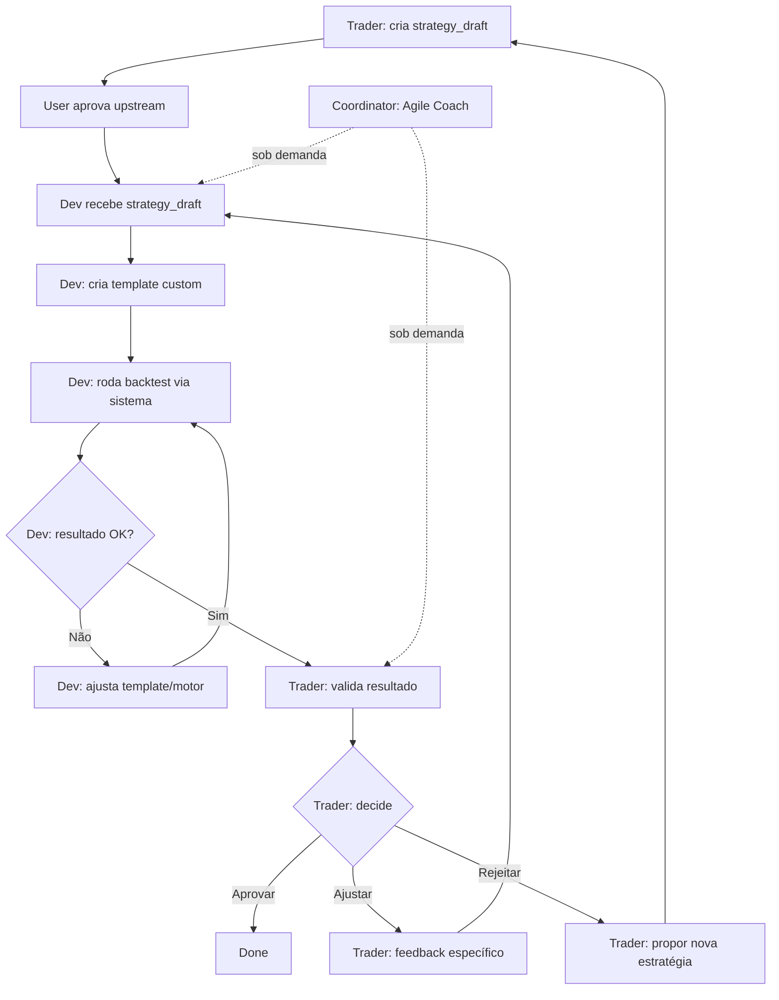

# Change Proposal: Manual Upstream Approval UI

**Change ID:** auto-upstream-completion  
**Type:** Enhancement  
**Status:** Draft  
**Created:** 2026-02-10  
**Updated:** 2026-02-10 (scope change: manual approval with UI button)

## Summary

Implementar **botão de aprovação manual** na UI para permitir que o humano aprove o `strategy_draft` gerado pelo Trader antes de progredir para a fase de decisão (Dev → Validator → Trader final).

## Why

**Fase Upstream (contexto):**
A fase **upstream** é uma **conversa/brainstorm iterativo** entre o **Trader** (persona LLM) e o **humano**:
- Trader faz perguntas pra entender o objetivo, símbolo, timeframe, restrições
- Humano responde de forma livre (não precisa seguir formato rígido)
- Quando Trader tiver informação suficiente, ele gera um `strategy_draft` (proposta inicial de estratégia) e marca `ready_for_user_review: true`
- **Nesse ponto, o humano decide:** aprovar o draft OU continuar conversando pra ajustar

**Problema atual:**
Quando o Trader completa o brainstorm e marca `ready_for_user_review: true`:
1. O sistema marca o run como `status: ready_for_review`
2. O campo `upstream_contract.approved: true` é setado
3. **MAS** não há botão de aprovação na UI — o humano não consegue **finalizar a conversa**
4. **RESULTADO:** O run fica **travado** — UI mostra "Aguardando execução das personas..." mas não progride porque falta a aprovação manual

**Fluxo desejado (correto):**

**Objetivo:**
- Adicionar **botão "Aprovar Upstream"** na UI quando `ready_for_user_review: true`
- Quando o humano clicar:
  - Backend recebe POST `/upstream/approve`
  - Marca `upstream.user_approved = true`
  - Emite evento `upstream_approved`
  - Progride para `status: ready_for_execution`
  - Inicia a sequência de personas (coordinator → dev → validator → trader)

## Scope

**In scope:**
- **Frontend:** Botão "Aprovar Upstream" quando `ready_for_user_review: true`
- **Backend:** Endpoint `POST /api/lab/runs/{run_id}/upstream/approve`
- **Estado:** Transição de `ready_for_review` → `ready_for_execution` após aprovação manual
- **Eventos:** Emissão de `upstream_approved` com inputs validados

**Out of scope:**
- Aprovação automática (explicitamente rejeitada — deve ser manual)
- Modificar o fluxo do Trader ou estrutura do `strategy_draft`
- Alterar a lógica de personas (Dev, Validator, etc.)

## Success Criteria

1. **Conversa upstream clara:** UI mostra histórico completo da conversa entre Trader e humano (todas as mensagens trocadas)
2. **Visualização do draft:** Quando Trader gera o `strategy_draft`, ele deve ser exibido de forma legível (indicadores, entry/exit rules, risk plan, perguntas abertas)
3. **Botão de aprovação:** Botão "Aprovar Upstream" aparece quando `ready_for_user_review: true` e `user_approved: false`
4. **Opção de continuar conversando:** Mesmo com `ready_for_user_review: true`, humano pode enviar mais mensagens ao Trader (ex: "ajusta o RSI pra 35/65") em vez de aprovar imediatamente
5. **Interação:** Clicar no botão chama endpoint `/upstream/approve` e desabilita o botão (loading state)
6. **Backend:** Endpoint marca `user_approved: true`, emite evento `upstream_approved`, e retorna `status: ready_for_execution`
7. **Progressão:** Após aprovação, sequência de personas inicia automaticamente (coordinator → dev → validator → trader)
8. **UX:** Após clicar "Aprovar", UI mostra feedback visual ("Aprovado! Iniciando análise...") e progride para próxima fase

## Risks & Mitigations

| Risk | Impact | Mitigation |
|------|--------|------------|
| Usuário aprova sem ler o draft completo | Médio | Exibir resumo claro do `strategy_draft` acima do botão; botão só fica disponível após scroll/visualização |
| Aprovação duplicada (múltiplos cliques) | Baixo | Desabilitar botão após primeiro clique; backend tem guard de idempotência |
| Runs existentes travados sem botão | Médio | Adicionar lógica de fallback: se run antigo em `ready_for_review`, mostrar botão de aprovação retroativo |

## Implementation Notes

**Backend:**
- **Arquivo:** `backend/app/routes/lab.py`
- **Novo endpoint:** `POST /api/lab/runs/{run_id}/upstream/approve`
- **Lógica:**
  1. Verifica se `ready_for_user_review: true` e `user_approved: false`
  2. Marca `upstream.user_approved = true`
  3. Emite evento `upstream_approved` com inputs
  4. Retorna run atualizado com `status: ready_for_execution`

**Frontend:**
- **Arquivo:** `frontend/src/pages/LabRunDetail.tsx` (ou componente equivalente)
- **Componente:** Botão condicional que aparece quando `run.upstream.ready_for_user_review && !run.upstream.user_approved`
- **Ação:** `onClick` chama API `POST /upstream/approve` → atualiza estado local → UI reflete mudança

## Dependencies

- **Frontend:** React + Axios (já existente)
- **Backend:** FastAPI (já existente)
- Nenhuma dependência externa nova

## Timeline

- **Spec → Design:** ~15min
- **Backend (endpoint):** ~15min
- **Frontend (botão + integração):** ~25min
- **Testes manuais:** ~15min (criar run, aprovar, verificar progressão)
- **Total estimado:** ~70min
