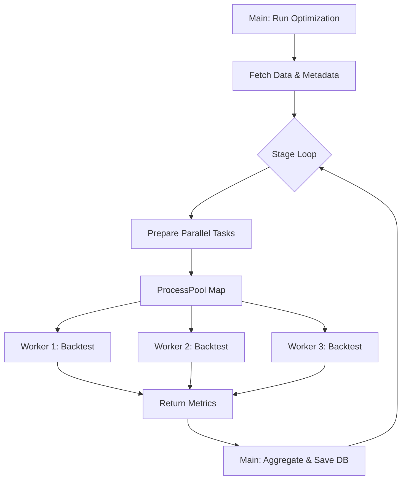

# Design: Parallel Optimization

## Architecture

The optimization process typically involves:
1.  **Orchestrator**: Generating stages and iterating through them sequentially.
2.  **Controller**: Iterating through possible values for a parameter (e.g., `sma_long` from 20 to 100).
3.  **Executor**: Running a backtest for a specific configuration.

We will modify the **Controller** layer to dispatch **Executor** tasks in parallel.

### Multiprocessing Model

We will use `concurrent.futures.ProcessPoolExecutor` instead of `ThreadPoolExecutor`.
*   **Why Process?** Backtesting is CPU-intensive (calculation heavy). Python's GIL limits threads to one CPU core for Python bytecode. Processes bypass the GIL.
*   **Constraints**: Data passed to/from workers must be picklable. Database connections (SQLite, SQLAlchemy sessions) are *not* picklable.

### Strategy Refactoring

Current `backtest_service.run_backtest` relies on database queries to fetch strategy logic or save results. This must be decoupled for the worker.

**New Worker Flow**:
1.  **Main Process**: 
    - Fetches `template_metadata` (indicators, logic) *before* loop.
    - Fetches market data (`df`) *before* loop.
2.  **Worker Process**:
    - Receives `template_metadata`, `parameters`, and `df` as arguments.
    - Reconstructs `ComboStrategy` in memory.
    - Runs `generate_signals` and calculates metrics.
    - Returns minimal result dict (`metrics`, `trades_summary`).
3.  **Main Process**:
    - Collects results.
    - Saves to database (persistence handling remains in the main process).

## Data Flow

